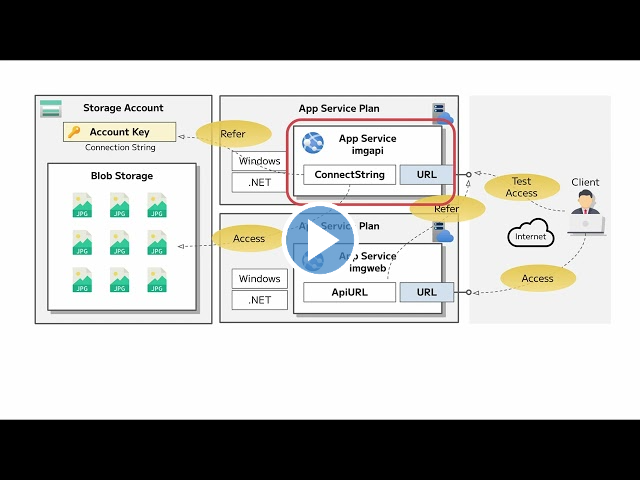
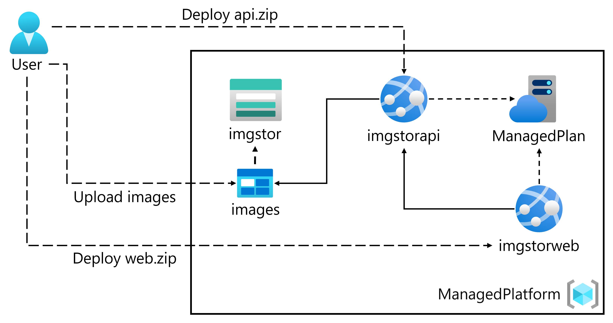

---
lab:
  az204Title: 'Lab 01: Build a web application on Azure platform as a service offerings'
  az204Module: 'Learning Path 01: Implement Azure App Service Web Apps'
---

# ラボ 01: AzureのPaaSを利用してWebアプリケーションを構築する

## Microsoft Azure ユーザー インターフェイス

Microsoft クラウド ツールの動的な性質を考慮すると、このトレーニング コンテンツの開発の後に発生する Azure UI の変更に気付くかもしれません。 その結果、ラボの指示とラボの手順が正しく整合しなくなる可能性があります。

Microsoft は、コミュニティから必要な変更の通知があったときに、このトレーニング コースを更新します。 ただし、クラウドの更新は頻繁に発生するため、このトレーニング コンテンツの更新の前に UI の変更に気付く可能性があります。 **これが発生した場合は、その変更に適応し、ラボでは必要に応じてそれらに対応してください。**

## Instructions

### 開始する前に

#### ラボ環境にサインインする

次の資格情報を使用して Windows 11 仮想マシン (VM) にサインインします。

- ユーザー名: `Admin`
- パスワード: `Pa55w.rd`

> **注**: 仮想ラボ環境に接続するための手順は、インストラクターから提供されます。

#### インストールされているアプリケーションを確認する

Windows 11 デスクトップでタスク バーを探します。 タスク バーには、このラボで使用する次のようなアプリケーションのアイコンが含まれています。

- Microsoft Edge
- エクスプローラー
- ターミナル
- Visual Studio Code

## 課題シナリオ

このラボでは、PaaS モデルを使用して Azure 上に Web アプリケーションを作成する方法を確認します。 Web アプリケーションが作成された後、Apache Kudu zip デプロイ オプションを使用して既存の Web アプリケーション ファイルをアップロードする方法について学習します。 その後、新しくデプロイした Web アプリケーションを表示してテストします。

<em>''この **[ビデオ リンク](https://youtu.be/EiSEcU9qjfo)** を右クリックし、[新しいタブまたは新しいウィンドウでリンクを開く] を選択して、このビデオを表示します。''</em>



## アーキテクチャの図



### 演習 1: Azure Storage と Azure App Service の Web Apps 機能を使用してバックエンド API をビルドする

#### タスク 1: Azure portal を開く

1. タスク バーで、**Microsoft Edge** アイコンを選択します。

1. ブラウザー ウィンドウで、Azure portal (`https://portal.azure.com`) に移動してから、このラボで使用するアカウントでサインインします。

   > **注**: Azure portal に初めてサインインしている場合は、ポータルのツアーが表示されます。 このツアーをスキップする場合は、 **[後で行う]** を選択してポータルの使用を開始します。

#### タスク 2: ストレージ アカウントを作成する

1. Azure portal で、 **[リソース、サービス、ドキュメントの検索]** テキスト ボックスを使用して**ストレージ アカウント**を検索し、結果の一覧で **[ストレージ アカウント]** を選択します。

1.  **[ストレージ アカウント]**  ブレードで **[+ 作成]** を選択します。

1.  **[ストレージ アカウントを作成する]**  ブレードの **[基本]** タブで、次のアクションを実行し、 **[確認]** を選択します。

    | 設定 | アクション |
    |--|--|
    | **[サブスクリプション]** ドロップダウン リスト | 既定値のままにします |
    | **[リソース グループ]** セクション | **[新規作成]** を選択し、「**ManagedPlatform**」と入力して **[OK]** を選択します |
    | **[ストレージ アカウント名]**  テキスト ボックス | 「**imgstor** _[ご自分の名前]_ 」と入力します。 |
    | **[リージョン]** ドロップダウン リスト | **[(米国) 米国東部]** を選択します |
    | **[パフォーマンス]** セクション | **[Standard]** オプションを選択します |
    | **[冗長性]** ドロップダウン リスト | **[ローカル冗長ストレージ (LRS)]** を選択します |

   次のスクリーンショットには、 **[ストレージ アカウントを作成する]** ブレードの **[基本]** タブで構成された設定が表示されています。

   ![[ストレージ アカウントを作成する] ブレード](./media/l01_create_a_storage_account.png)

1. **[確認]** タブで、前の手順で選択したオプションを確認します。

1. **[作成]** を選択して、指定した構成を使用してストレージ アカウントを作成します。

   > **注**: 作成タスクが完了するまで待ってから、このラボを続行してください。

1. **[概要]** ブレードで、 **[リソースに移動]** ボタンを選択して、新しく作成されたストレージ アカウントのブレードに移動します。

1.  **[ストレージ アカウント]**  ブレードの **[セキュリティとネットワーク]**  セクションで、 **[アクセス キー]** を選択します。

1.  **[アクセス キー]** ブレードで、**接続文字列**のいずれかを確認し (**[表示]** ボタンを使用)、**[接続文字列]**  ボックスの値をメモ帳に記録します。 **キー**はプラットフォームで管理される暗号化キーであり、このラボでは使用**しません**。

   > **注**: どの接続文字列を選択しても問題ありません。 これらは交換可能です。

1. メモ帳を開き、コピーした接続文字列の値をメモ帳に貼り付けます。 この値は、このラボの後の方で使用します。

#### タスク 3: サンプル BLOB をアップロードする

1. **[ストレージ アカウント]** ブレードの **[データ ストレージ]** セクションで、 **[コンテナー]** リンクを選択します。

1. **[コンテナー]** ブレードで、 **[+ コンテナー]** を選択します。

1. **[新しいコンテナー]** ウィンドウで、次のアクションを実行し、**[作成]** を選択します。

   | 設定 | アクション |
   | --- | --- |
   | **[名前]** テキスト ボックス | 「**images**」と入力します |

1. **[コンテナー]** ブレードで、新しく作成された **images** コンテナーを選択します。

1. **[images]** ブレードで、 **[アップロード]** を選択します。

1. **[BLOB のアップロード]** ウィンドウで、次のアクションを実行します。

    | 設定 | アクション |
    |--|--|
    | **[ファイル]** セクション | **[ファイルの参照]** を選択するか、ドラッグ アンド ドロップ機能を使用します |
    | **[エクスプローラー]** ウィンドウ | **Allfiles (F):\\Allfiles\\Labs\\01\\Starter\\Images** を参照し、**grilledcheese.jpg** ファイルを選択してから **[開く]** を選択します |
    | **[ファイルが既に存在する場合は上書きする]** チェック ボックス | このチェック ボックスがオンになっていることを確認してから、 **[アップロード]** を選択します |

    > **注**: BLOB がアップロードされるまで待ってから、このラボを続行してください。

#### タスク 4: Web アプリを作成する

1. Azure portal のナビゲーション ウィンドウで、 **[リソースの作成]** を選択します。

1. **[リソースの作成]** ブレードで、**[サービスとマーケットプレースの検索]** テキスト ボックスに「**Web アプリ**」と入力し、Enter キーを押します。

1. **[マーケットプレース]** 検索結果ブレードで、 **[Web アプリ]** の結果を選択します。

1. **[Web アプリ]** ブレードで **[作成]** を選択します。

1. **[Web アプリの作成]** ブレードの **[基本]** タブで、次のアクションを実行してから、**[監視およびセキュリティで保護]** タブを選択します。

   | 設定                            | アクション                                                                                                  |
   | ---------------------------------- | ------------------------------------------------------------------------------------------------------- |
   | **[サブスクリプション]** ドロップダウン リスト    | 既定値のままにします                                                                                |
   | **[リソース グループ]** セクション         | **[ManagedPlatform]** を選択します                                                                              |
   | **[名前]**  テキスト ボックス                  | 「**imgapi** _[ご自分の名前]_ 」と入力します                                                                            |
   | **[公開]** セクション                | **[コード]** を選択します                                                                                         |
   | **[ランタイム スタック]** ドロップダウン リスト   | **[.NET 8 (LTS)]** を選びます                                                                                 |
   | **[オペレーティング システム]** セクション       | **[Windows]** を選択します                                                                                      |
   | **[リージョン]** ドロップダウン リスト          | **[米国東部]** リージョンを選択します                                                                           |
   | **[Windows プラン (米国東部)]** セクション | **[新規作成]** を選択し、 **[名前]** テキスト ボックスに「**ManagedPlan**」という値を入力して **[OK]** を選択します |
   | **[価格プラン]** セクション           | **[Standard S1]** を選択します                                                                                  |

   次のスクリーンショットには、 **[Web アプリの作成]** ブレードで構成された設定が表示されています。

   ![[Web アプリの作成] ブレード](./media/l01_create_a_web_app.png)

1. **[監視およびセキュリティ保護]** タブの **[Application Insights を有効にする]** セクションで、**[いいえ]** を選択してから **[確認および作成]** を選択します。

1. **[確認および作成]** タブで、前の手順で選択したオプションを確認します。

1. **[作成]** を選択して、指定した構成を使用して Web アプリを作成します。

   > **注**: Web アプリが作成されるまで待ってから、このラボを続行してください。

1. **[概要]** ブレードで、 **[リソースに移動]** ボタンを選択して、新しく作成された Web アプリのブレードに移動します。

#### タスク 5: Web アプリを構成する

1. **[App Service]** ブレードの **[設定]** セクションで、**[環境変数]** リンクを選択します。

1. **[アプリ設定]** タブで **[+ 追加]** を選択します。 **[アプリケーション設定の追加/編集]** ポップアップ ダイアログに次の情報を入力します。

    | 設定 | アクション |
    |--|--|
    | **[名前]** テキスト ボックス | 「**StorageConnectionString**」と入力します |
    | **[値]** テキスト ボックス | 前にコピーしたストレージ接続文字列をメモ帳に貼り付けます |
    | **[デプロイ スロットの設定]** チェック ボックス | 既定値のままにします |

1. **[適用]** を選択してポップアップ ダイアログを閉じ、**[アプリ設定]** セクションに戻ります。

1. **[アプリ設定]** セクションの下部にある **[適用]** を選択します。

   >**注:**  アプリ設定を更新すると、アプリが再起動される可能性があるという警告が表示される場合があります。 **確認** を選択します。 アプリケーション設定が保存されるまで待ってから、このラボを続行してください。

1. App Service の URL を取得するには、 **[概要]** リンクに移動し、 **[既定のドメイン]** セクションから値をコピーし、メモ帳に貼り付けます。 メモ帳でドメイン名の前に `https://` を付けます。 この値は、ラボの後半で使用します。

   > **注**: この時点では、この URL の Web サーバーはプレースホルダー Web ページを返します。 Web アプリには、コードがまだデプロイされていません。 このラボの後の方で Web アプリにコードをデプロイします。

#### タスク 6: `ASP.NET` Web アプリケーションを Web Apps にデプロイする

1. タスク バーで、 **[Visual Studio Code]** アイコンを選択します。

1. **[ファイル]** メニューの **[フォルダーを開く]** を選択します。

1. **[エクスプローラー]** ウィンドウで、**Allfiles (F):\\Allfiles\\Labs\\01\\Starter\\API** を参照し、 **[フォルダーの選択]** を選択します。

   > **注**: ビルドとデバッグに必要な資産を追加したり、復元コマンドを実行して未解決の依存関係に対処したりするためのプロンプトは無視してください

1. **[Visual Studio Code]** ウィンドウの **[エクスプローラー]**  ペインで  **[コントローラー]** フォルダーを展開し、**ImagesController.cs** ファイルを選択して、このファイルをエディターで開きます。

1. エディターの 26 行目にある **ImagesController** クラスで、**GetCloudBlobContainer** メソッドと、コンテナーを取得するために使用されるコードを確認します。

1. 36 行目にある **ImagesController** クラスで、**Get** メソッドと、すべての BLOB を **[images]** コンテナーから非同期的に取得するために使用されるコードを確認します。

1. 68 行目にある **ImagesController** クラスで、**Post** メソッドと、アップロードされた画像をストレージに保持するために使用されるコードを確認します。

1. タスク バーで、**[ターミナル]** アイコンを選択します。

1. 開いたターミナルで次のコマンドを入力し、Enter キーを押して Azure コマンド ライン インターフェイス (CLI) にログインします。

   ```
   az login
   ```

1. **[Microsoft Edge]** ブラウザー ウィンドウで、Microsoft アカウントの電子メール アドレスとパスワードを入力し、 **[サインイン]** を選択します。

1. 現在開いている**ターミナル** ウィンドウに戻ります。 サインイン プロセスが完了するまで待ちます。

1. ターミナルで次のコマンドを入力し、Enter キーを選択して、**ManagedPlatform** リソース グループ内のすべてのアプリを一覧表示します。

   ```
   az webapp list --resource-group ManagedPlatform
   ```

1. 次のコマンドを入力してから Enter キーを押して、**imgapi\*** というプレフィックスが付いたアプリを見つけます。

   ```
   az webapp list --resource-group ManagedPlatform --query "[?starts_with(name, 'imgapi')]"
   ```

1. 次のコマンドを入力してから Enter キーを押して、**imgapi\*** というプレフィックスが付いた 1 つのアプリの名前のみをレンダリングします。

   ```
   az webapp list --resource-group ManagedPlatform --query "[?starts_with(name, 'imgapi')].{Name:name}" --output tsv
   ```

1. 次のコマンドを入力してから Enter キーを押して、現在のディレクトリを、ラボ ファイルが含まれている **Allfiles (F):\\Allfiles\\Labs\\01\\Starter\\API** ディレクトリに変更します。

   ```
   cd F:\Allfiles\Labs\01\Starter\API\
   ```

1. 次のコマンドを入力してから Enter キーを押して、**api.zip** ファイルを、このラボで前に作成した Web アプリにデプロイします。

   ```
   az webapp deployment source config-zip --resource-group ManagedPlatform --src api.zip --name <name-of-your-api-app>
   ```

   > **注**: *\<name-of-your-api-app\>* のプレースホルダーを、このラボで前に作成した Web アプリの名前に置き換えてください。 前の手順で先ほど、このアプリの名前にクエリを実行しました。

   デプロイが完了するまで待ってから、このラボを続行してください。

1. Azure portal の**ナビゲーション** ウィンドウで、 **[リソース グループ]** リンクを選択します。

1. **[リソース グループ]** ブレードで、このラボで前に作成した **[ManagedPlatform]** リソース グループを選択します。

1. **[ManagedPlatform]** ブレードで、このラボで前に作成した **[imgapi** _[ご自分の名前]]_ Web アプリを選択します。

1. **[App Service]** ブレードから、 **[参照]** を選択します。

   > **注**: この **[参照]** コマンドでは、Web サイトのルートに対して GET 要求を実行します。これにより、JSON (JavaScript Object Notation) 配列が返されます。 この配列には、ストレージ アカウント内のアップロードされた 1 つの画像の URL が含まれています。

1. Azure portal が含まれているブラウザー ウィンドウに戻ります。

1. 現在実行中の Visual Studio Code アプリケーションとターミナル アプリケーションを閉じます。

#### 確認

この演習では、Azure で Web アプリを作成した後、Azure CLI と Apache Kudu zip ファイル デプロイ ユーティリティを使用して `ASP.NET` Web アプリケーションを Web Apps にデプロイしました。

### 演習 2: Azure Web Apps を使用してフロントエンド Web アプリケーションをビルドする

#### タスク 1: Web アプリを作成する

1. Azure portal の**ナビゲーション** ウィンドウで、 **[リソースの作成]** を選択します。

1. **[リソースの作成]** ブレードで、**[サービスとマーケットプレースの検索]** テキスト ボックスに「**Web アプリ**」と入力し、Enter キーを押します。

1. **[マーケットプレース]** 検索結果ブレードで、 **[Web アプリ]** を選択します。

1. **[Web アプリ]** ブレードで **[作成]** を選択します。

1. **[Web アプリの作成]** ブレードの **[基本]** タブで、次のアクションを実行してから、**[監視およびセキュリティで保護]** タブを選択します。

   | 設定                            | アクション                        |
   | ---------------------------------- | ----------------------------- |
   | **[サブスクリプション]** ドロップダウン リスト    | 既定値のままにします      |
   | **[リソース グループ]** セクション         | **[ManagedPlatform]** を選択します    |
   | **[名前]**  テキスト ボックス                  | 「**imgweb** _[ご自分の名前]_ 」と入力します  |
   | **[公開]** セクション                | **[コード]** を選択します               |
   | **[ランタイム スタック]** ドロップダウン リスト   | **[.NET 8 (LTS)]** を選びます       |
   | **[オペレーティング システム]** セクション       | **[Windows]** を選択します            |
   | **[リージョン]** ドロップダウン リスト          | **[米国東部]** リージョンを選択します |
   | **[Windows プラン (米国東部)]** セクション | **[ManagedPlan (S1)]** を選択します   |

次のスクリーンショットには、 **[Web アプリの作成]** ブレードで構成された設定が表示されています。

![[Web アプリの作成] ブレード](./media/l01_create_a_front_end_web_app.png)

1. **[監視およびセキュリティ保護]** タブの **[Application Insights を有効にする]** セクションで、**[いいえ]** を選択してから **[確認および作成]** を選択します。

1. **[確認および作成]** タブから、前の手順で選択したオプションを確認します。

1. **[作成]** を選択して、指定した構成を使用して Web アプリを作成します。

   > **注**: 作成タスクが完了するまで待ってから、このラボを続行してください。

1. **[概要]** ブレードで、 **[リソースに移動]** ボタンを選択して、新しく作成された Web アプリのブレードに移動します。

#### タスク 2: Web アプリを構成する

1. **[App Service]** ブレードの **[設定]** セクションで、**[環境変数]** リンクを選択します。

1. **[環境変数]** セクションで、次のアクションを実行し、**[保存]** を選択してから **[続行]** を選択します。

    | 設定 | アクション |
    |--|--|
    | **[アプリ設定]** タブ | **[新しいアプリケーション設定]** を選択します。 |
    | **[アプリケーション設定の追加/編集]** ポップアップ ダイアログ | **[名前]** テキスト ボックスに「**ApiUrl**」と入力します |
    | **[値]** テキスト ボックス | このラボで前にコピーした Web アプリ URL を入力します。 **注**: このアプリケーション設定の **[値]** テキスト ボックスにコピーする URL には、プロトコル **https://** を必ず含めるようにしてください |
    | **[デプロイ スロットの設定]** チェック ボックス | 既定値のままにして **[OK]** を選択します |
    | トップ メニューの **[保存]** をクリックします | これにより、入力した構成値が保存されます |

   > **注**: アプリケーション設定が保存されるまで待ってから、このラボを続行してください。

#### タスク 3: `ASP.NET` Web アプリケーションを Web Apps にデプロイする

1. タスク バーで、 **[Visual Studio Code]** アイコンを選択します。

1. **[ファイル]** メニューの **[フォルダーを開く]** を選択します。

1. **[エクスプローラー]** ウィンドウで、**Allfiles (F):\\Allfiles\\Labs\\01\\Starter\\Web** を参照し、 **[フォルダーの選択]** を選択します。

   > **注**: ビルドとデバッグに必要な資産を追加したり、復元コマンドを実行して未解決の依存関係に対処したりするためのプロンプトは無視してください

1. **[Visual Studio Code]** ウィンドウの **[エクスプローラー]**  ペインで  **[ページ]** フォルダーを展開し、**Index.cshtml.cs** ファイルを選択して、このファイルをエディターで開きます。

1. エディターの 30 行目にある **IndexModel** クラスで、**OnGetAsync** メソッドと、API から画像の一覧を取得するために使用されるコードを確認します。

1. 41 行目にある **IndexModel** クラスで、**OnPostAsync** メソッドと、アップロードされた画像をバックエンド API にストリーミングするために使用されるコードを確認します。

1. タスク バーで、**[ターミナル]** アイコンを選択します。

1. 開いたターミナルで次のコマンドを入力し、Enter キーを選択して、Azure CLI にサインインします。

   ```
   az login
   ```

1. **[Microsoft Edge]** ブラウザー ウィンドウで、Microsoft アカウントの電子メール アドレスとパスワードを入力し、 **[サインイン]** を選択します。

1. 現在開いている**ターミナル** ウィンドウに戻ります。 サインイン プロセスが完了するまで待ちます。

1. 次のコマンドを入力してから Enter キーを押して、 **[ManagedPlatform]** リソース グループ内のすべてのアプリを一覧表示します。

   ```
   az webapp list --resource-group ManagedPlatform
   ```

1. 次のコマンドを入力してから Enter キーを押して、**imgweb\*** というプレフィックスが付いたアプリを見つけます。

   ```
   az webapp list --resource-group ManagedPlatform --query "[?starts_with(name, 'imgweb')]"
   ```

1. 次のコマンドを入力してから Enter キーを押して、**imgweb\*** というプレフィックスが付いた 1 つのアプリの名前のみをレンダリングします。

   ```
   az webapp list --resource-group ManagedPlatform --query "[?starts_with(name, 'imgweb')].{Name:name}" --output tsv
   ```

1. 次のコマンドを入力してから Enter キーを押して、現在のディレクトリを、ラボ ファイルが含まれている **Allfiles (F):\\Allfiles\\Labs\\01\\Starter\\Web** ディレクトリに変更します。

   ```
   cd F:\Allfiles\Labs\01\Starter\Web\
   ```

1. 次のコマンドを入力してから Enter キーを押して、**web.zip** ファイルを、このラボで前に作成した Web アプリにデプロイします。

   ```
   az webapp deployment source config-zip --resource-group ManagedPlatform --src web.zip --name <name-of-your-web-app>
   ```

   > **注**: *\<name-of-your-web-app\>* のプレースホルダーを、このラボで前に作成した Web アプリの名前に置き換えてください。 前の手順で先ほど、このアプリの名前にクエリを実行しました。

   デプロイが完了するまで待ってから、このラボを続行してください。

1. Azure portal の**ナビゲーション** ウィンドウで、 **[リソース グループ]** を選択します。

1. **[リソース グループ]** ブレードで、このラボで前に作成した **[ManagedPlatform]** リソース グループを選択します。

1. **[ManagedPlatform]** ブレードで、このラボで前に作成した **[imgweb** _[ご自分の名前]]_ Web アプリを選択します。

1. **[App Service]** ブレードで、 **[参照]** を選択します。

1. ギャラリー内の画像の一覧を確認します。 ギャラリーには、このラボで前にストレージにアップロードされた 1 つの画像が表示されるはずです。

1. **[Contoso 写真ギャラリー]** Web ページの **[新しい画像のアップロード]** セクションで、次のアクションを実行します。

   a. **[参照]** を選択します。

   b. [**エクスプローラー**] ウィンドウで、**Allfiles (F):\\Allfiles\\Labs\\01\\Starter\\Images** を参照し、**bahnmi.jpg** ファイルを選択してから [**開く**] を選択します。

   c. **[アップロード]** を選択します。

1. ギャラリーの画像の一覧が新しい画像によって更新されていることを確認します。

   > **注**: 一部のまれなケースとして、新しい画像を取得するためにブラウザー ウィンドウの更新が必要になることがあります。

1. Azure portal が含まれているブラウザー ウィンドウに戻ります。

1. 現在実行中の Visual Studio Code アプリケーションとターミナル アプリケーションを閉じます。

#### 確認

この演習では、Azure Web アプリを作成し、既存の Web アプリケーションのコードをクラウド内のリソースにデプロイしました。
